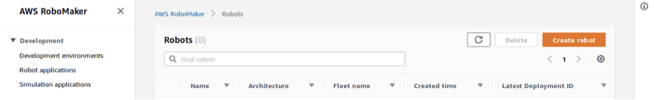
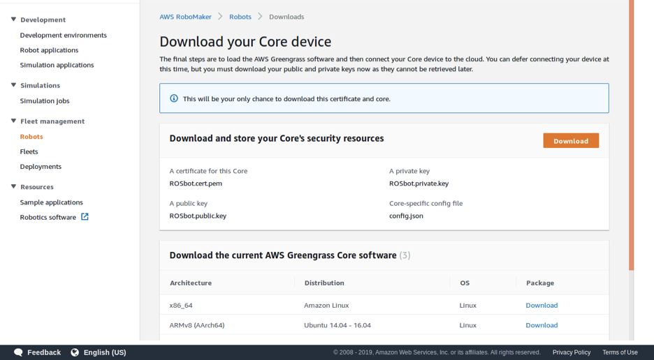
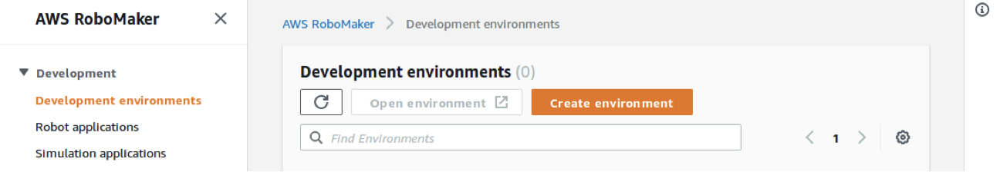
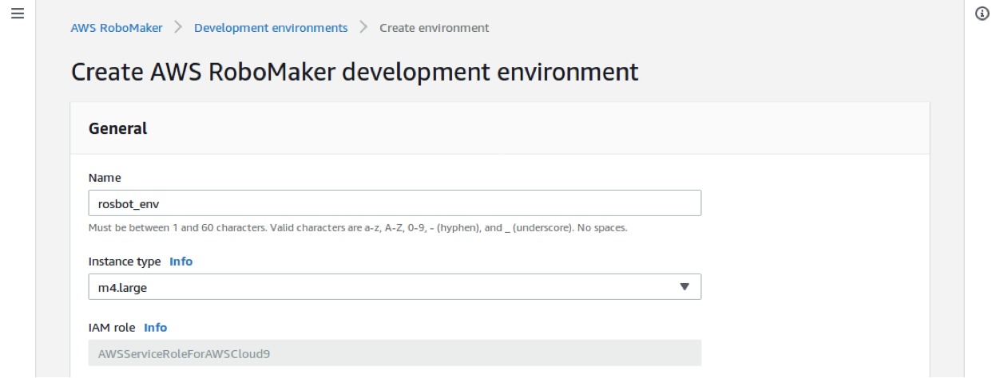
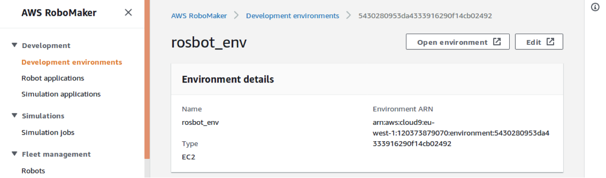
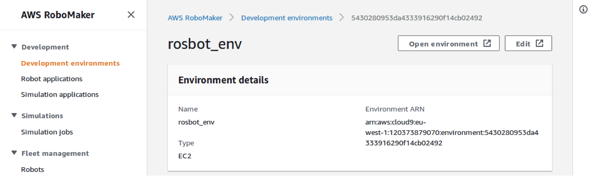
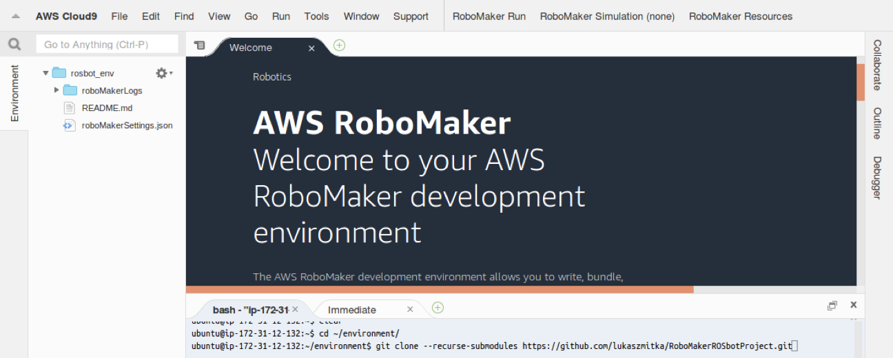
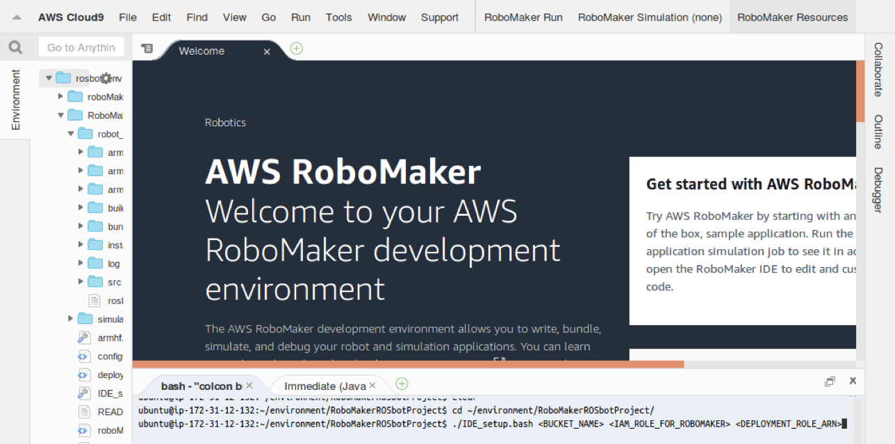
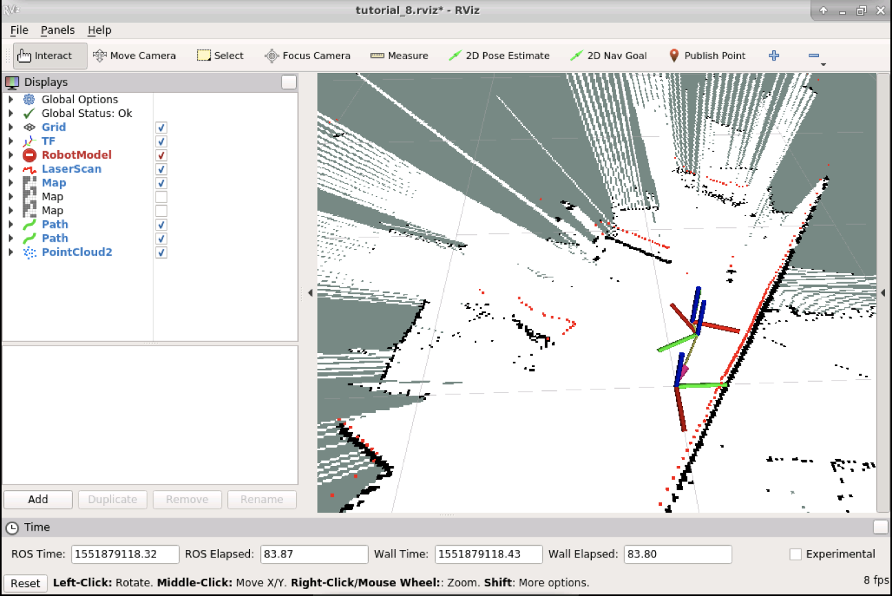

## RoboMaker ROS 项目演示


### 配置 AWS 环境 

在我们使用 AWS RoboMaker 构建和部署教程应用程序之前，需要先设置 AWS 环境。为了简化配置，使用 AWS CloudFormation模板快速部署。通过CloudFormation 会在 Amazon S3 中创建一个存储桶，在 AWS Identity and Access Manager (IAM) 中创建 AWS RoboMaker模拟和部署我们的机器人应用程序所需的必要权限。 

登录CloudFormation 控制台。 按照以下步骤部署模板： 

1. 下载模板文件 [这里 ](https://github.com/sihochina/robot_sim/blob/main/robot_sim_template.yaml)。 
2. 单击 **创建堆栈** 按钮。 
3. 再*选择模板* ，选择*上传到 Amazon S3* ，然后单击 **选择文件** ，选择在步骤 1 中下载的 robot_sim_template.yaml 文件。 
4. 下一步输入 *Stack name* 。 
5. 在 *S3BucketName* 字段中，为将创建的 S3 存储桶提供全局唯一名称。 该 S3 存储桶将用于存储您的机器人应用程序包，以及您的机器人在模拟过程中可能生成的任何日志。
6. 在 Options 页面上，保留所有默认值并选择 下一步 。 
7. 在 Review 页面上，单击复选框以确认 CloudFormation 将代表您创建 IAM 资源，单击 **创建** 。 

创建堆栈需要几分钟的时间，当状态变为 CREATE_COMPLETE 时，选择您刚刚创建的堆栈，并查看其输出。  

### RoboMaker 中的 ROSbot 设置 

在 Greengrass 能够运行和部署应用程序之前，ROSbot 需要进行一些系统修改。

- 登录 AWS RoboMaker控制台。
- 在左侧导航窗格中，选择 **Fleet Management** ，然后选择 **Robots** 。 



- 选择*创建机器人* ，在 **名称** 字段中，键入 rosbot，从 **架构** 下拉菜单中选择 **ARMHF** 。 
- 从 **AWS Greengrass 组** 下拉菜单中选择 **Create new** ，在 **AWS Greengrass 前缀** 字段类型中 rosbot. 
- 在 **IAM 角色中** 选择 **ROSbot-deployment-role** 。 


- 继续 **创建** ，您将被重定向到 download your core device 页面。 



- 单击 Download 按钮 **and store your Core's security resources** 您将获得 ROSbot-setup.zip文件。 
- 从 **Download the current AWS Greengrass Core software** 选择 **ARMv71 架构，下载 greengrass-linux-armv7l-1.9.2.tar.gz文件。 
- 这两个文件都需要上传到ROSbot。 上传过程会有所不同，具体取决于您的主机操作系统。 以Linux系统为例，导航到下载文件的目录，默认情况下应该是 ~/Downloads.

```bash
cd ~/Downloads
```

- 将这两个文件复制到您的 ROSbot，您需要替换 ROSBOT_IP使用您之前记下的设备地址： 

```bash
scp ROSbot-setup.zip user@ROSBOT_IP:ROSbot-setup.zip
scp greengrass-linux-armv7l-1.9.2.tar.gz user@ROSBOT_IP:greengrass-linux-armv7l-1.9.2.tar.gz
```

### 创建 RoboMaker开发环境

应用程序将使用 RoboMaker 环境构建，需要创建 Robomaker开发环境： 

- 登录 AWS RoboMaker控制台。



- 左侧选择 **Development environment** ，然后选择 **Create environment** 。 
- 在创建 AWS RoboMaker 开发环境页面中，输入rosbot_env作为环境名称，实例类型类型选择m4.large。 
- 在 **VPC** 和子网保留默认。 



- 选择 **创建** 以创建 AWS Cloud9 开发环境。 



### 部署ROS应用程序 

要部署应用程序，需要使用在上一步中创建的 RoboMaker 环境： 

- 转到 AWS RoboMaker 控制台。 
- 左侧选择 **Development environment** ，选择rosbot_env。
- 单击 **Open environment**。



- 在 IDE 中，转到 bash 选项卡并克隆 `rosbot-robomaker`存储库在 `~/environment/`目录： 

```bash
cd ~/environment/
git clone --recurse-submodules https://github.com/sihochina/robot_sim.git RoboMakerROSbotProject
```



- 启动配置脚本，需要提供 CloudFormation 之前创建的 IAM 角色的 S3 存储桶名称和 ARN。  脚本的参数应设置为 CloudFormation 堆栈输出中提供的相应值，该脚本将安装所有依赖项、配置项目、构建和设置部署作业。 

```bash
cd ~/environment/RoboMakerROSbotProject/
./IDE_setup.bash <S3BucketName> <RoboMakerRole> <ROSbotDeploymentRole>
```



脚本完成其工作后，您可以观察部署过程： 

- 登录 AWS RoboMaker控制台。 
- 左侧选择 **Fleet Management** ，然后选择 **Deployments** 。 
- 出现新部署时，单击其名称将其打开。 
- 等待部署状态更改为 **成功** - ROSbot 将开始探索环境。 


### 查看结果 

本Demo中，ROSbots 的任务是自主探索周围的环境，它将驱动到任何可访问的位置，可以实时观察 ROSbot 是如何构建地图的。

打开终端机菜单 `Applications`-> `Terminal emulation`并执行：  

```bash
rviz -d $(rospack find tutorial_pkg)/rviz/tutorial_8.rviz
```

可以看到带有已创建地图和计划轨迹的 Rviz 可视化工具，也可以在下面的屏幕截图中看到正在创建的示例地图，地图完成后，ROSbot 将停止并等待进一步的命令，可以使用在地图上设置目的地点 **`2D Nav Goal`**中的按钮 **Rviz** 。 



